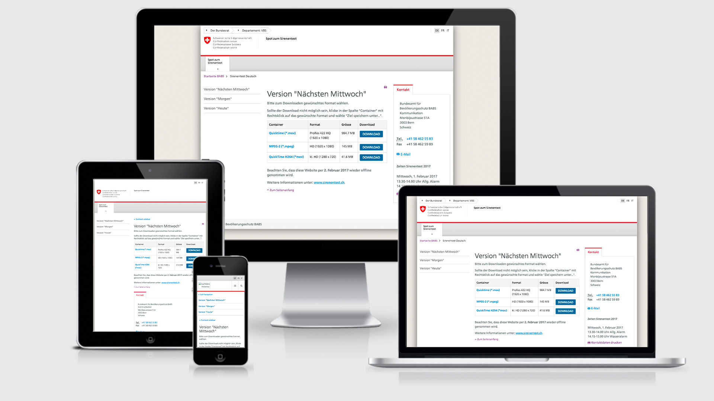

Version: 1.0.1 _(21.04.2017 - see changelog for details)_

---

[Grav](https://getgrav.org) theme using [swiss style guide](https://github.com/swiss/styleguide) for the [landing page](https://babs.zem.ch) of the Federal Office for civil Protection FOCP.

**! Important: If you have another swiss styleguide Grav theme activated on your site, it may be necessary to edit the theme name manually in system.yaml (see instruction below)**

# Installation

### Installation (using Grav Admin)
Simply copy the `grav-babs-theme` folder in to your Grav `user/themes` folder and activate it via Grav admin plugin.

### Installation (not using Grav Admin)
1. Copy the `grav-babs-theme` folder to your Grav `user/themes` folder. 
2. Open your `user/config/system.yaml` and add `grav-babs-theme` to the following entry:
 
```
pages:
  theme: grav-babs-theme
```
That`s it.  

# Issues
Found an issue? Report it using the issues on this repo. Thanks for your contibution.